# Hope Music Academy Blog

Sharing is caring!. 
Hope Music Academy Blog is the space to share. For HMA this is the part where we
share information and open ourselves to our students and anyone wants to get in the 
conversation and get involve.

## Table of contents  
1. [General Info and Design](#general-info-and-design)
2. [Goals](#goals)  
    2.1 [Project goals](#project-goals)  
    2.2 [User goals](#user-goals)  
    2.3 [Site owners goals](#site-owners-goals)  
    2.4 [Target audience](#target-audience)  
3. [User Experience (UX)](#user-experience-ux)  
    [User stories](#user-stories)  
    3.1 [First time user](#first-time-user)  
    3.2 [Returning user](#returning-user)  
    3.3 [Site owner](#site-owner)  
4. [Design](#design)  
    4.1 [Logo](#logo)  
    4.2 [Pages, Header and Navigation](#pages-header-and-navigation)  
    4.3 [Footer section](#footer-section)
5. [Wireframes](#wireframes)  
    - [NavBar/Header](#navbarheader)  
    - [Homepage](#homepage)  
6. [Colour palette](#colour-palette)
7. [Contrast check](#contrast-check)
8. [Typography](#typography)
9. [Flowchart and Databases](#flowcharts-and-databases)  
10. [Features](#features)  
11. [Existing features](#existing-features)  
12. [Future Features](#future-features-to-be-implemented)  
13. [Testing](#testing) 
14. [Validation](#validations-performed)
15. [Deployment](#deployment-of-website)
16. [Technology](#technology)
17. [Credits](#credit)
18. [Bug and Fixes](#bugs-and-fixes)

## General Info and Design
The HopeBlog can be use by all ages. It has been developed with simplicity in mind and some of the goals
 is to inform, have a social presence and maybe even inspire its users. It is also a way to educate the 
end user about topics and news relate to music.

The expected audience will be mostly our students and their families, but also it will be open to anyone interested
in reading the posted information and/or anyone who wants to post information and help to expand and contribute 
to the blog.  

The interface is simple, intrusive, clean and familiar. found in most blog sites and websites. With a small 
palette of colours and good contrast. 

## Goals  
### Project goals  
- Provide a platform for sharing information where anyone interested can read and post.
- Promote the Hope Music Academy brand   
- Created a web presence.  
- Learn from the community.   

### User Goals
- Find information about music and teaching related topics. 
- Share information.  
- Easily register and browse posts.

### Site owners goals  
- Get the students more involve with the school.  
- Provide more information about related topics. 
- Bild trust with its students and families.
- Self-promotion.

### Target audience  
- All ages and audiences. But Primarily mostly our students and their immediate families.
- Also those looking for information in a related music topic providing the information has been posted. 

## User Experience (UX)  
While building the project, it was clear that the user interface had to be simple and functional, clean and 
easily understood in order to provide an enjoyable positive good user experience. As the application is aimed 
at all ages, logical placement of buttons and understandable form fields will all be clearly tagged.  

### User stories  
#### First time user  
-- As a first-time user:
- I want to understand what the purpose of the site.  
- I want to be able to easily navigate the platform.
- I want to register easy.  
- I want to view posts.   
- I want to create posts  
- I want to know how to log out.  

#### Returning user  
-- As a returning user:
- I want to be able to easily login.  
- I want to be able to edit posts created by me.  
- I want to be able to view my details.  
- I want to be able to edit my details.  
- I want to be able to view individual posts.
- I want to be able to view posts by an individual.
- I want to be able to delete my account.  

#### Site owner  
-- As the site owner:
- I want visitors understand the platform easily.  
- I want visitors to gain more information and learn new facts.  
- I want visitors to register to see, create or edit posts.  

## Design  
###Logo
The School logo in this case was not used. Instead, the name of the company was used on the left side
of the navigation bar to continue with concept of clarity and simplicity, easily understood by all audiences.
The header/NavBar and footer are consistent in all areas of the website. Navigation is also easy and consistent.

The colours used are mostly Black and White which contrast each other and give a sense of elegance and clarity 
throughout the platform.   

###Pages, Header and Navigation
The website platform is responsive therefore it can be view in mobile, tablets and desktops. The header and footer
are consistent in all the pages of the platform only changing the main content area. Navigation bar / Header is also consistent
with the navigation buttons on the top right-hand side of the screen and the name of the company on the top-left side of the screen.

On devices tablet and mobiles the user will be able to expand/collapse this 3 line menu button that toggles down to 
access the menu items available.  

####Footer section  
The footer section only have the copyright info with space for future option s to be added later.   

### Wireframes  
Wireframe designs show navigation concepts for Mobile and Desktop views. Since, both the navbar/header and footer are consistent
throughout the application, wireframes were developed for the above-mentioned and for the main page only as the main content of 
the page is  changing section for every page.

#### NavBar/Header  

Mobile and Desktop NavBar

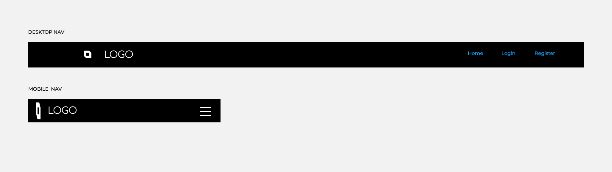

#### Homepage  

Main Homepage Concept

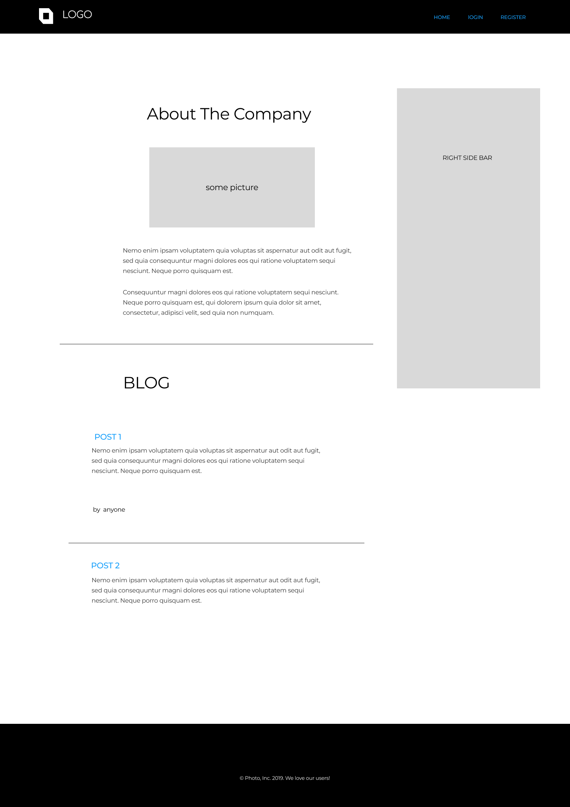

footer

### Colour palette  
The web platform uses a black background (#212529) on header and footer with white (#FFFFFF) colour font providing good contrast.
The body is mostly the opposite, Black font against a white background. 

The web application for the buttons use different color depending on the function of the button, for example, in the
profile page the DELETE button is red (#DC3545) with white font. 

Contrast Grid was used to contrast combinations. Picture below of colours user on the entire web application.

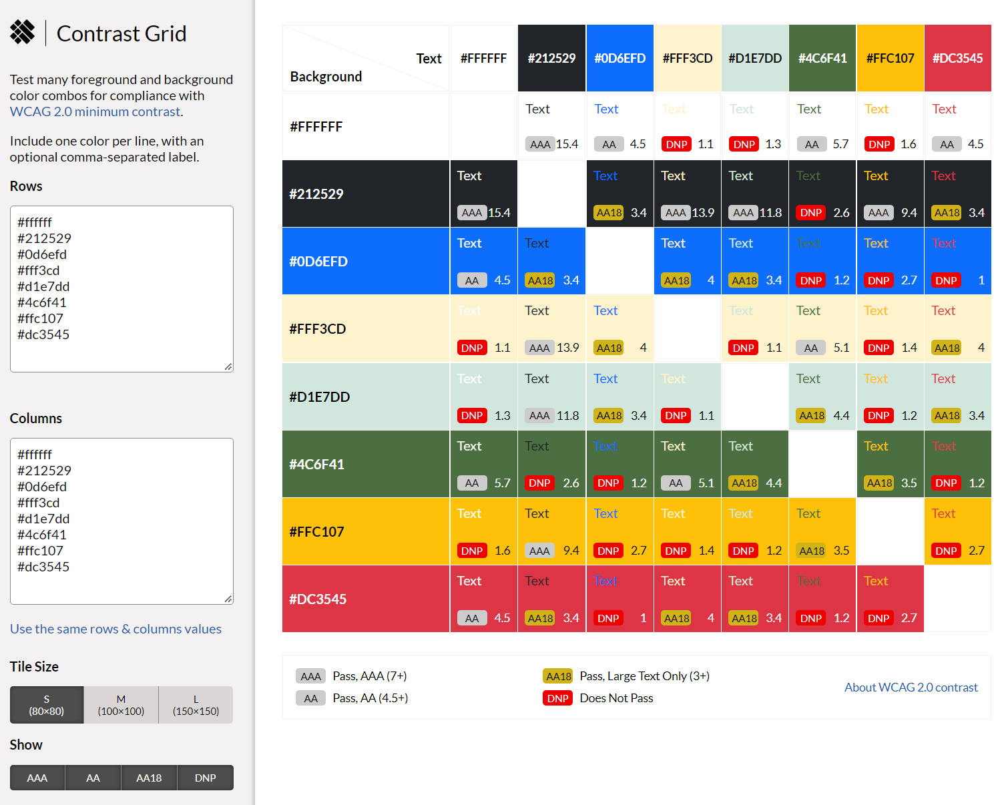   

the persistent link to the palette above can be view here: 
[live colour palette](https://contrast-grid.eightshapes.com/?version=1.1.0&background-colors=%23ffffff%0D%0A%23212529%0D%0A%230d6efd%0D%0A%23fff3cd%0D%0A%23d1e7dd%0D%0A%234c6f41%0D%0A%23ffc107%0D%0A%23dc3545&foreground-colors=%23ffffff%0D%0A%23212529%0D%0A%230d6efd%0D%0A%23fff3cd%0D%0A%23d1e7dd%0D%0A%234c6f41%0D%0A%23ffc107%0D%0A%23dc3545&es-color-form__tile-size=compact&es-color-form__show-contrast=aaa&es-color-form__show-contrast=aa&es-color-form__show-contrast=aa18&es-color-form__show-contrast=dnp) 

### Contrast Check
 [Color Contrast Accessibility Validator](https://color.a11y.com/) used to automatically check the pages. Results bellow:
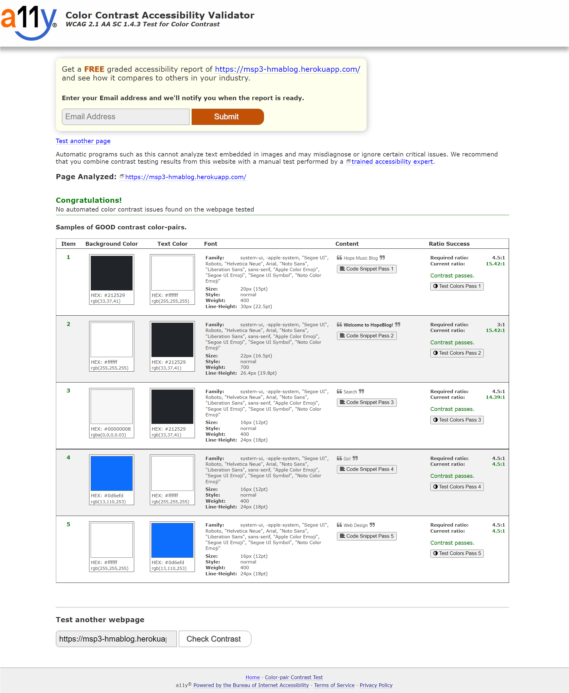

### Typography
Fonts used across the application were provided by Blog Post a simple Bootstrap starter template from 
[Start Bootstrap](https://startbootstrap.com/template/blog-post). Include font like: 
Segoe UI, Roboto, Helvetica Neue with default fall-back of Sans-Serif.

### Flowcharts and databases  
Flowchart shows the path for any web application user:.  
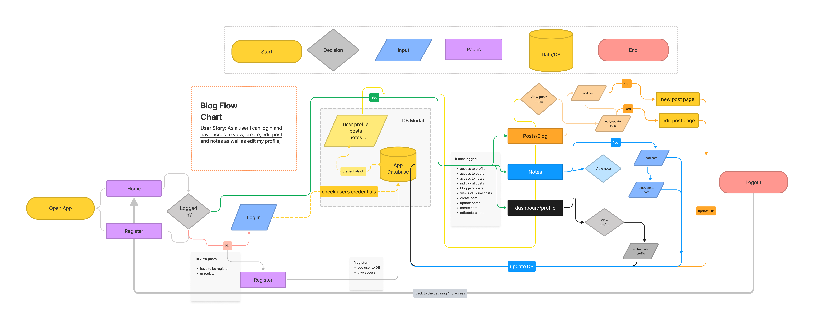  
  
Database schema diagram as used when a user register for an account:
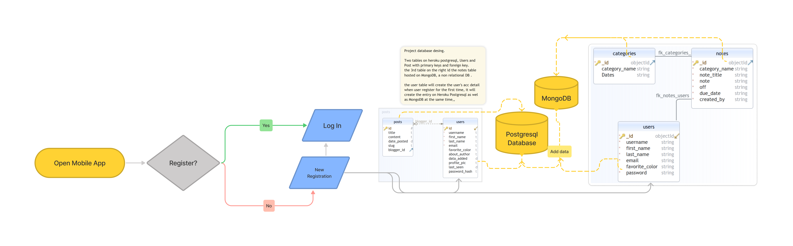  

### Features  
This section looks at features which were implemented and those that with further research and
knowledge will add to the existing set of features.  

#### Existing features
Users can:
- register and create an account
- create, edit, and delete posts
- view posts
- view individual posts
- view all posts from a user
- read, edit, create and delete notes
- view and edit profile details

#### Future Features to be implemented
- Password recovery and change
- Email notifications
- Sidebar section to refactor
- Search function
- Ability to comment on posts
- Ability to manage own comments
- Change/Add profile picture

## Testing 
A number of testing were carried out once the website completed. Documents can 
be found in the folder " [test-docs]() " for full details of the testng carried out

#### Validations performed

- PEP8 validation.
- Google Lighthouse for performance
- Colour contrast validation 

## Deployment of Website

This website was developed and hosted using **GitHub pages** and stored in repositories on Github. 

PyCharm was use for the development environment and Git was installed as an extension.

 
The website was deployed using Github Pages and Heroku. To do this while in the github webpages of the project repository: 
1. on the menu that appears on the right-hand side of the page under 'Environments' you can find a link to `github-pages` with anc Active batch on the side.
2. Click on either, github-pages or Environments, it will take you to the `Deployment history` page.
3. Once on the Deployment history page on the right-hand side you will se a `View Deployment` button. 
4. Click on `View Deployment` and this will open the home page of the website in a new window.

Alternatively the links below can be use to directly open the website or go to the repositories:

Link to repositories:
[REPO - MSP3-HMABLOG](https://github.com/NickyFrs/MP3-HMABLOG)

Link to Deployed Website:
[Heroku Deployment](https://msp3-hmablog.heroku.app.com/)

## Technology
- GitHub was where the files were stored.
- PyCharm IDE as editing environment used to create and edit files.
- [PEP8 Validator](http://pep8online.com/) used for the JavaScript code validation.
- [MongoDB](https://www.mongodb.com/) used for the notes' creation. None Relational DB.
- [Heroku](https://www.heroku.com/) for the relational database (Postgresql) and deployment.
- [Start Bootstrap](https://startbootstrap.com/template/blog-post) used for the core template.
- [Bootstrap 5](https://getbootstrap.com/) was used for Collapse menu on about page and progress bars shown in the core value section on the same page.
- [Color Contrast Accessibility Validator](https://color.a11y.com/Contrast/)
- Express.adobe.com. 2022. Creative Cloud Express - Logo Maker. [online] Available at: <https://express.adobe.com/express-apps/logomaker/preview> [Accessed 3 May 2022]

## Credit

- Hope Music Academy for letting me use their content and allowing me to present the idea.
- The Code Institute tutorials.
- Philip Morris for guidance and help on testing.

- ##### Thanks for the visual guidance and help of YouTubers: 
   
     - www.youtube.com. (n.d.). Deploy Flask App With Database On Heroku For Webhosting - Flask Fridays #39. [online] Available at: https://www.youtube.com/watch?v=SiCAIRc0pEI&list=PLCC34OHNcOtolz2Vd9ZSeSXWc8Bq23yEz&index=41 [Accessed 4 Aug. 2022].
     - www.youtube.com. (n.d.). Python Flask Tutorial: Full-Featured Web App Part 4 - Database with Flask-SQLAlchemy. [online] Available at: https://www.youtube.com/watch?v=cYWiDiIUxQc&list=PL-osiE80TeTs4UjLw5MM6OjgkjFeUxCYH&index=9 [Accessed 4 Aug. 2022].
     - Grinberg, M. (n.d.). The Flask Mega-Tutorial Part XV: A Better Application Structure. [online] blog.miguelgrinberg.com. Available at: https://blog.miguelgrinberg.com/post/the-flask-mega-tutorial-part-xv-a-better-application-structure [Accessed 4 Aug. 2022].
     - flask-login.readthedocs.io. (n.d.). Flask-Login — Flask-Login 0.4.1 documentation. [online] Available at: https://flask-login.readthedocs.io/en/latest/#how-it-works.
     - pythonbasics.org. (n.d.). Flask SQLAlchemy (with Examples) - Python Tutorial. [online] Available at: https://pythonbasics.org/flask-sqlalchemy/.
     - Auth0 - Blog. (n.d.). SQLAlchemy ORM Tutorial for Python Developers. [online] Available at: https://auth0.com/blog/sqlalchemy-orm-tutorial-for-python-developers/.
     - Bardhan, S. (2021). Connecting to MongoDB Atlas with Python-PyMongo. [online] Analytics Vidhya. Available at: https://medium.com/analytics-vidhya/connecting-to-mongodb-atlas-with-python-pymongo-5b25dab3ac53 [Accessed 4 Aug. 2022].
     - flask-pymongo.readthedocs.io. (n.d.). Flask-PyMongo — Flask-PyMongo 2.3.0 documentation. [online] Available at: https://flask-pymongo.readthedocs.io/en/latest/#flask_pymongo.PyMongo [Accessed 4 Aug. 2022].
     - wtforms.readthedocs.io. (n.d.). WTForms — WTForms Documentation (3.0.x). [online] Available at: https://wtforms.readthedocs.io/en/3.0.x/.
     - Stack Abuse. (2021). Python: Validate Email Address with Regular Expressions (RegEx). [online] Available at: https://stackabuse.com/python-validate-email-address-with-regular-expressions-regex [Accessed 4 Aug. 2022].
     - Stack Abuse. (2021). Python: Validate Email Address with Regular Expressions (RegEx). [online] Available at: https://stackabuse.com/python-validate-email-address-with-regular-expressions-regex [Accessed 4 Aug. 2022].

  
---
### Bugs and Fixes
The following list pf bugs wre dealt with while on development:

-Undefined Error: 
    Problem:
    

here

    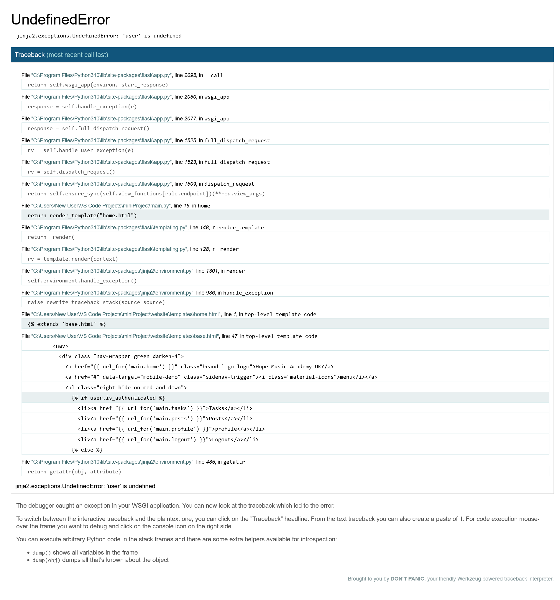

    Solution:
    

    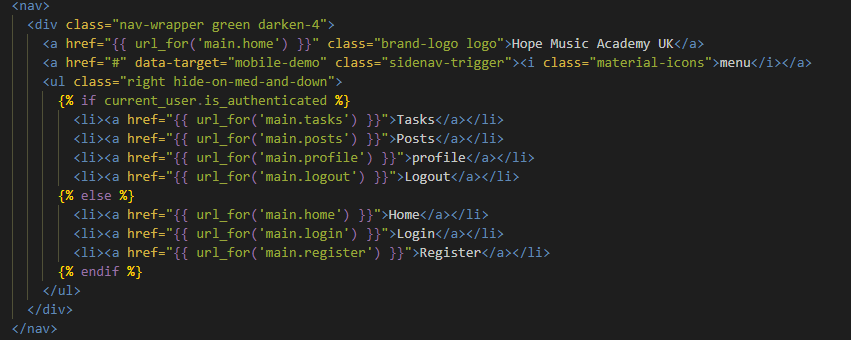

    from: (https://www.pythonfixing.com/2022/06/fixed-i-cannot-solve-this-error.html)

---
-Integrity Error: 
    Problem:
    

here

    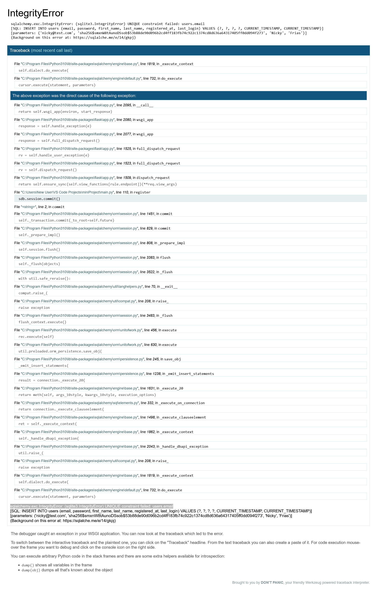

    Solution:
    

There wasn't a column in the database for username. Added the column but that created a Operational Error, shown below.

    

---
-Operational Error: 
    Problem:
    

here

    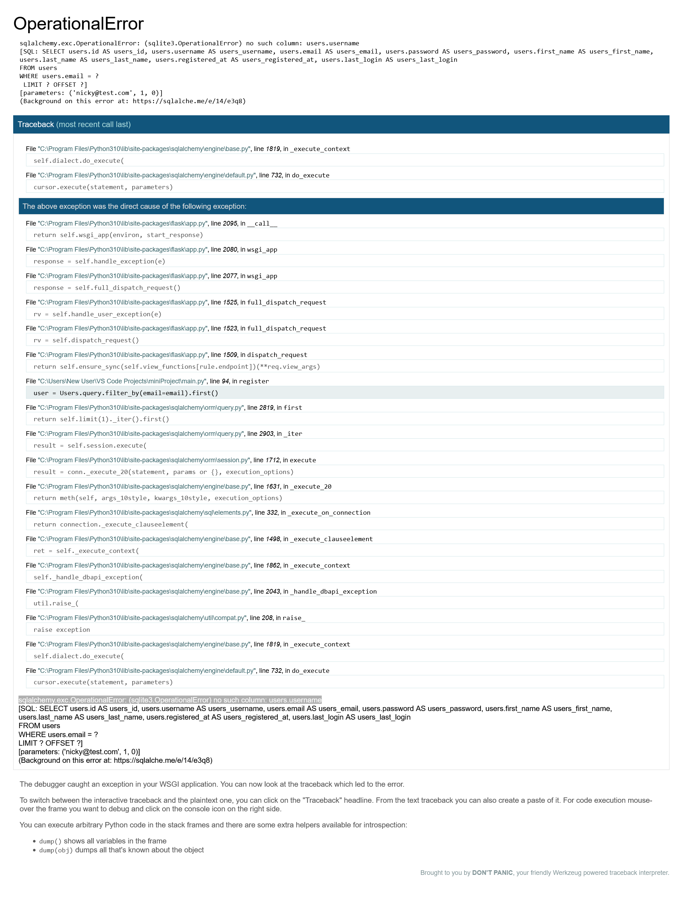

    Solution:
    

Solution to the operational error was to recreate the database (since it was empty otherwise would've to migrate instead).

---
-Heroku Issue: 
    Problem:
    

    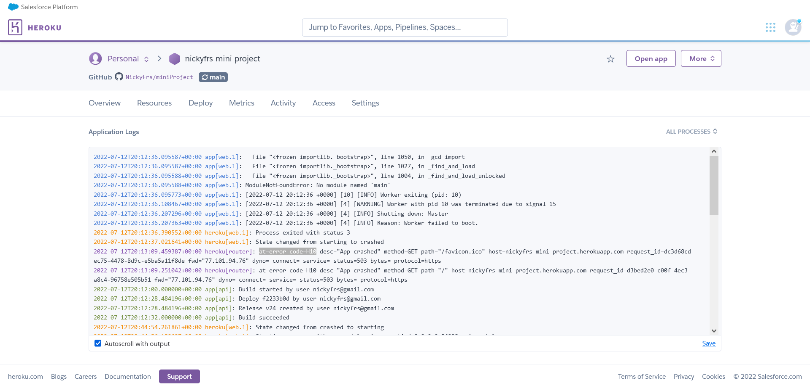

    Solution:here
    

the Procfile should've been web: gunicorn main:app where "main" is the file name in which app = create_app(). I had web: gunicorn app:app

    from: (https://stackoverflow.com/questions/59680256/flask-app-error-while-deploying-to-heroku-at-error-code-h10-desc-app-crashed-m)

